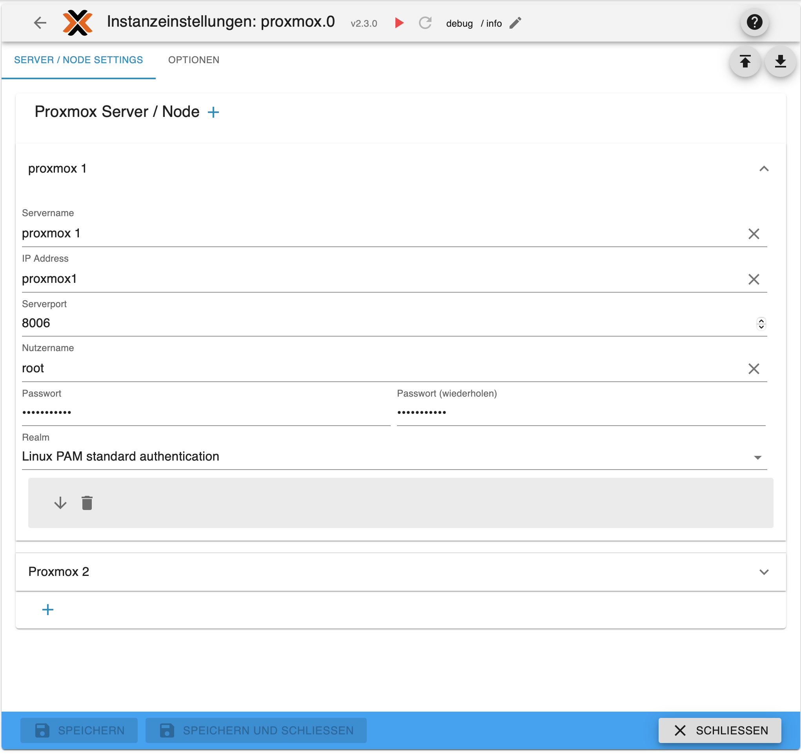
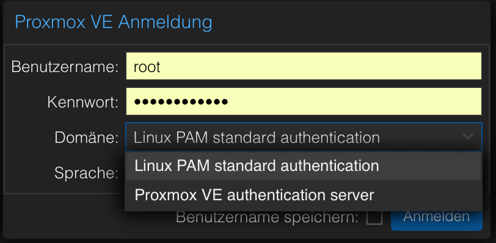
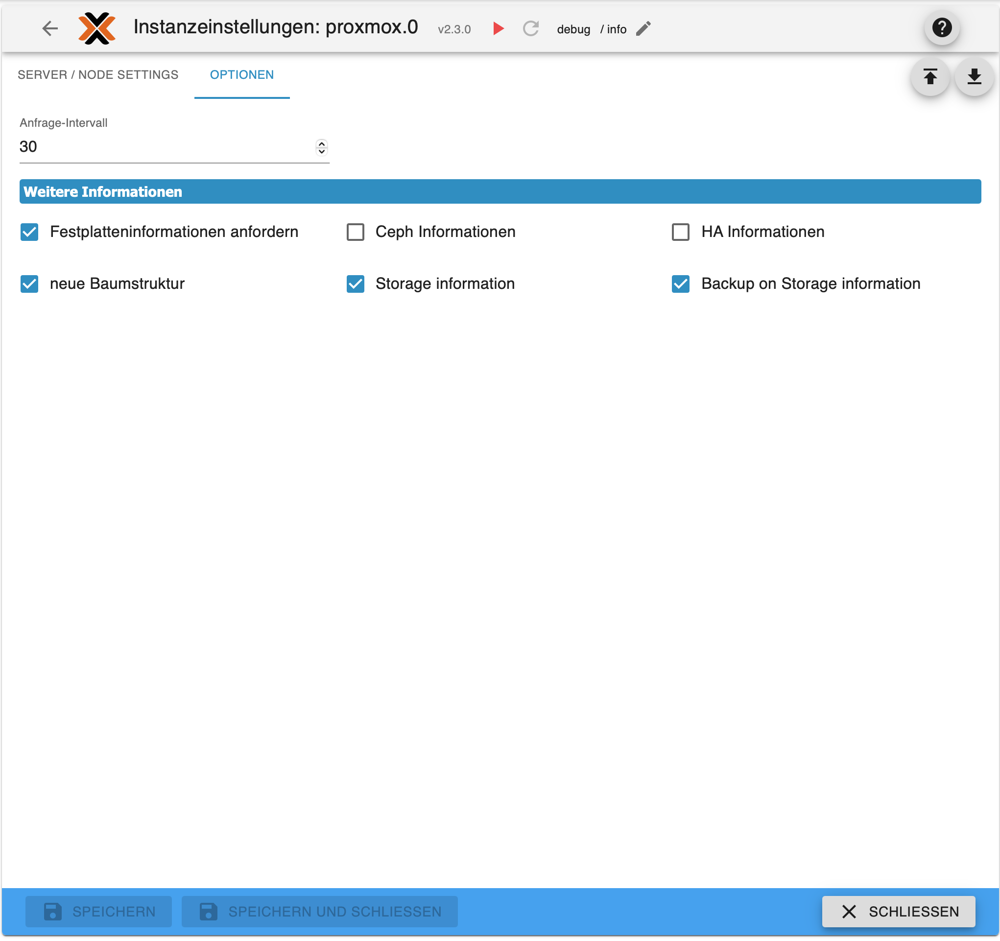
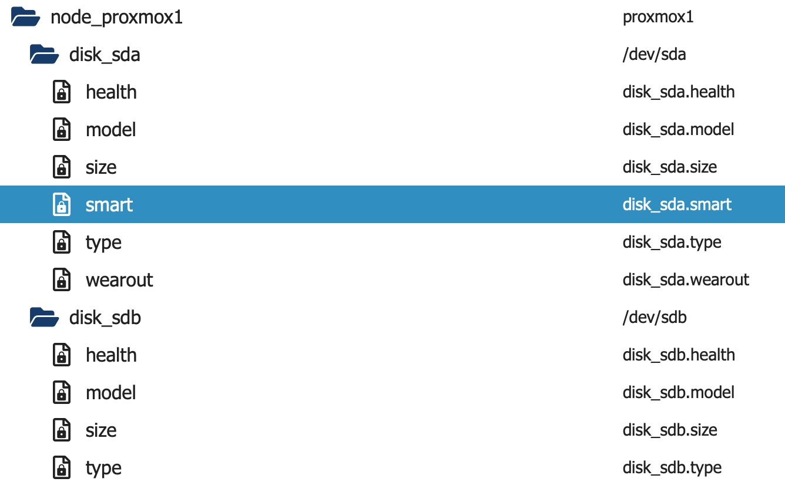
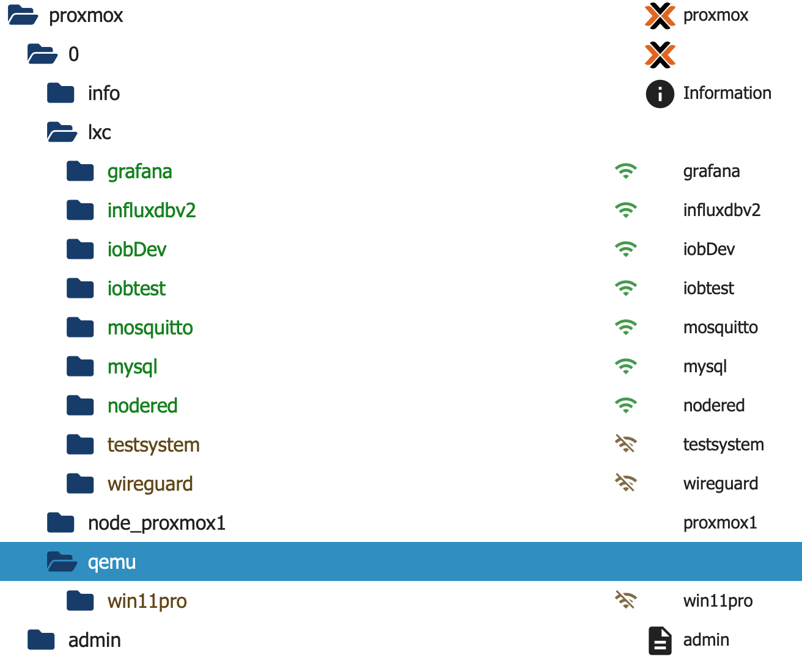
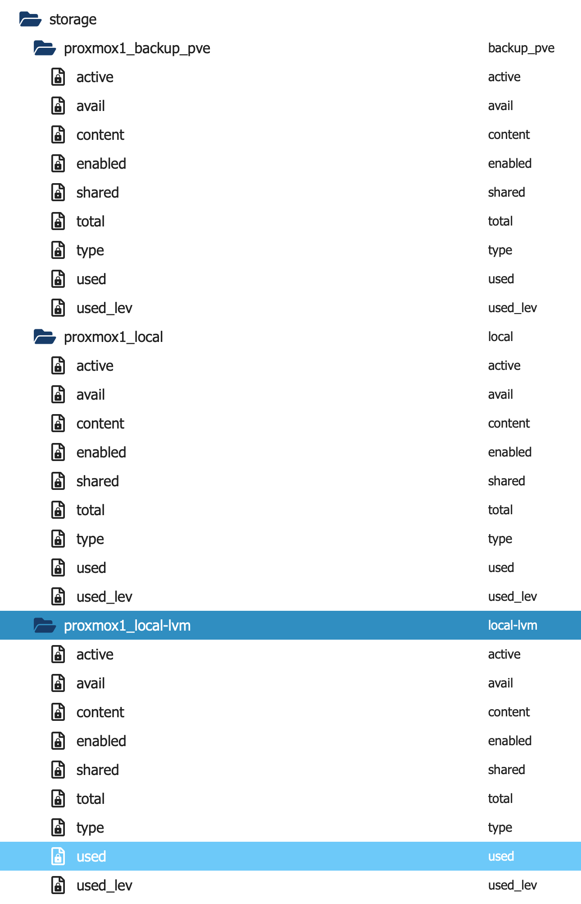
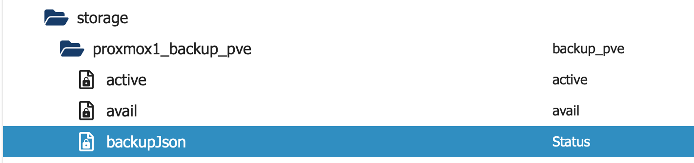

# ioBroker.proxmox

## Anforderungen
- Node.js 18 (oder neuer)
- js-controller 5.0.19 (oder neuer)
- Admin Adapter 6.13.16 (oder neuer)  
  
***  
## Server / Node Einstellungen 

Für jeden Server / Node werden hier die Zugangsdaten erfasst.

  

Durch klick auf die Überschrift (Proxmox 1) bzw. den kleinen Pfeil ganz rechts, wird der Inhalt aufgeklappt. Mit den Pfeilen hoch / runter kann die Reihenfolge bestimmt werden. Der Mülleimer löscht die Daten wieder. Das Plus dient zum Anlgen eines neuen Server.
  
### Servername
kann frei gewählt werden und wird für die Unterscheidung der einzelnen abschitte genutzt (siehe proxmox 2)  
    
### IP Adresse 
Die IP Adresse des Proxmox Server bzw. der Servername.
  
### Port  
Standard ist der Port 8006, wenn bei der Installation ein anderer Port eingestell wurde, muss dieser hier auch geändert.  

### Nutzername  
Bei der Installation wird root als Standard eingestellt. Wenn ein neuer User für den Abruf der Daten in Proxmox erstellt wird, kommt hier sein Loginname rein.  
  
### Passwort  
Passwort vom root bzw. vom neu erstellten User.  

### Realm
Auswahl zwischen `Standard Authentifizierung` und dem `Proxmox Authentifizierungsserver`.  
Als Standard sollte hier der selbe Dienst gewählt werden, wie im Login auf der Weboberfläche.  
  
  
## Optionen  

  

### Anfrage-Intervall  
Standard sind 30 Sekunden. Der kleinste Wert sind 5 Sekunden. 

### Festplatten Informationen
Bei der Auswahl werden in den Objekten diese Datenpunkte angelegt, diese können sich je nach Festplattentyp unterscheiden.  
  
  
### HA informationen  
in Arbeit  

### Ceph Informationen  
in Arbeit  

### neue Baumstruktur  
Bei der neuen Baumstruktur werden `LXC Container` und `VM` unter einen Hauptordner gesammelt.  
  
alte Struktur  
  
  
neue Struktur    
  
  
### Speicher Informationen / storage information
Hiermit werden die Informationen zu den verwendeten Speichertypen hinterlegt. 
  
  
### Backup Informationen
Es wird der Datenpunkt `backupJSON` unter den einzelnen Speicher / Storage angelegt.  
Hier im Beispiel des Backup-Speichers werden in dem JSON die Backups gelistet, welche in Proxmox konfiguriert wurden.  
  

zum Beispiel
```json
  "backup_pve:backup/vzdump-lxc-100-2024_12_24-03_00_03.tar.zst": {
    "subtype": "lxc",
    "format": "tar.zst",
    "volid": "backup_pve:backup/vzdump-lxc-100-2024_12_24-03_00_03.tar.zst",
    "ctime": 1735005603,
    "notes": "iobDev, 100",
    "vmid": 100,
    "content": "backup",
    "size": 3486489024
  },
  "backup_pve:backup/vzdump-lxc-100-2024_12_25-03_00_00.tar.zst": {
    "size": 3487399986,
    "notes": "iobDev, 100",
    "content": "backup",
    "vmid": 100,
    "format": "tar.zst",
    "volid": "backup_pve:backup/vzdump-lxc-100-2024_12_25-03_00_00.tar.zst",
    "ctime": 1735092000,
    "subtype": "lxc"
  },
  "backup_pve:backup/vzdump-lxc-100-2024_12_26-03_00_02.tar.zst": {
    "size": 3486595678,
    "content": "backup",
    "vmid": 100,
    "notes": "iobDev, 100",
    "ctime": 1735178402,
    "volid": "backup_pve:backup/vzdump-lxc-100-2024_12_26-03_00_02.tar.zst",
    "format": "tar.zst",
    "subtype": "lxc"
  },
```

